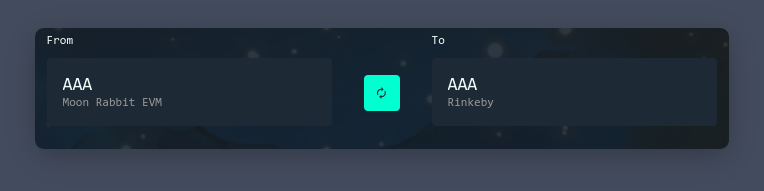

## Moon Rabbit Bridge

### Transfer ERC20 AAA to Moon Rabbit EVM

#### Attention does not need to close or interrupt the procedure if the first payment was made through Metamask (be attentive)

1. Open Bridge tab https://stage.hole.moonrabbit.com/bridge.

At the start, you will immediately be in the mode of translating tokens 
Next, the process of transfer of tokens is described 

3. Import our test token on Rinkeby network for further use. `0xB492c49881fB3BCAaFa0d5BB0EF83efF3C6220c7`

4. To get tokens from the Rinkeby external network on the network Moon Rabbit EVM you need to switch to Rinkeby Network to Metamask [Connecting to Metamask](moon_rabbit_evm/MetamaskConnecting.md)

If on the previous steps all the bullet is done correctly and you have test tokens you will see the interface above.

5. Select the required number of coins for translation and click Next.

Carefully check the information in the next window and confirm the translation

6. Next step Switch the network in the Metamask window to the network Moon Rabbit EVM.

After that press the Deposit button.

 
 ### For withdrow procedure 

 1. To withdrow coins from the network you need to press the switch button.

 2. The tokens will change the plates and you can start an withdrow procedure similar to replenishment. 

