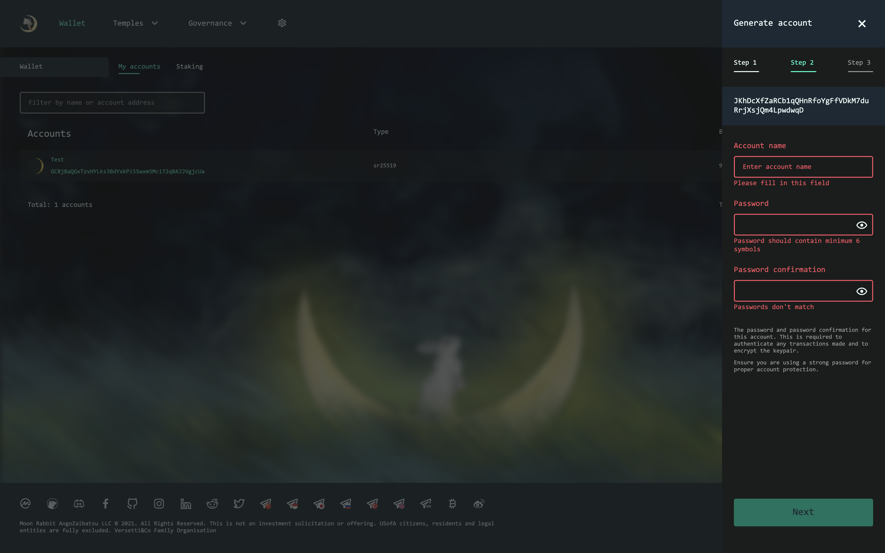
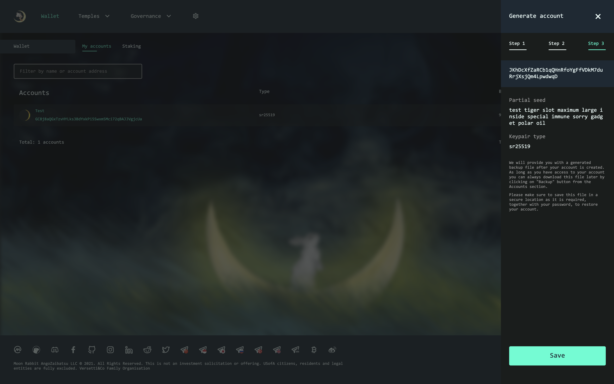

### How to generate new wallet

To create an account, click on the "Add Account" button.

In the pop-up window you will see a randomly generated seed phrase. Make sure to record it and store it in a secure place along with your wallet address.

Click on checkbox.

Next, you will need to set a username and password to be used for operations with this account.

Click "Next" to continue.

Make sure that all the data is correct and save the account. You will be prompted to save the json file with the data of the created account; in the future, you can use it to import the account on another device.

