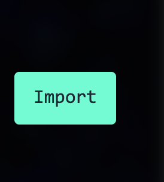
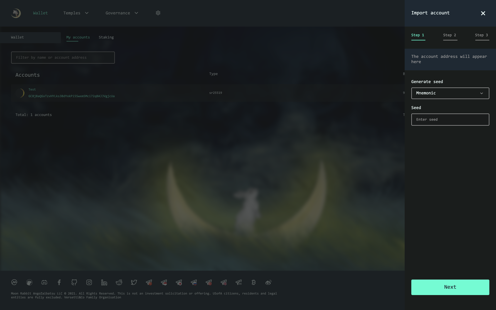
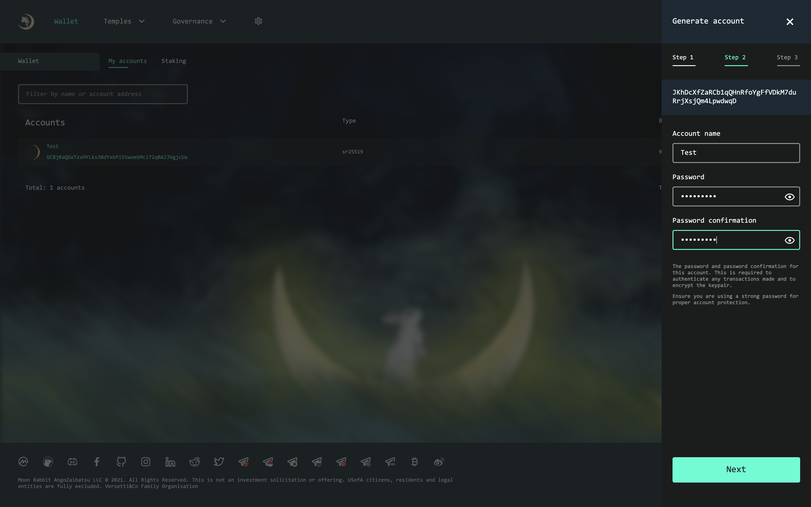

### How to import existing private key

There are 3 ways to restore or import account:
1) use a mnemonic phrase;
2) use a secret seed;
3) use the json file obtained during registration.

### Mnemonic phrase

Click on the "Import" button.

Enter your mnemonic phrase.

Activate checkbox.

Next, you will need to set a username and password to be used for operations with this account.

Click "Next" to continue.

Next, make sure that all the data is correct and save the account. You will be prompted to save the json file with the data of the created account; in the future, you can use it to import the account on another device.

### Secret seed

Click on the "Import" button

If you have a secret seed, switch the input mode in the window from mnemonic to raw seed.

Activate the checkbox so that you have saved the seed and are ready to continue and click "Next".

Now you will need to set a username and password to be used for operations with the account.

Click "Next" to continue.

Ensure that all the data is correct and save the account. You will be prompted to save the json file with the data of the created account; in the future, you can use it to import the account on another device

