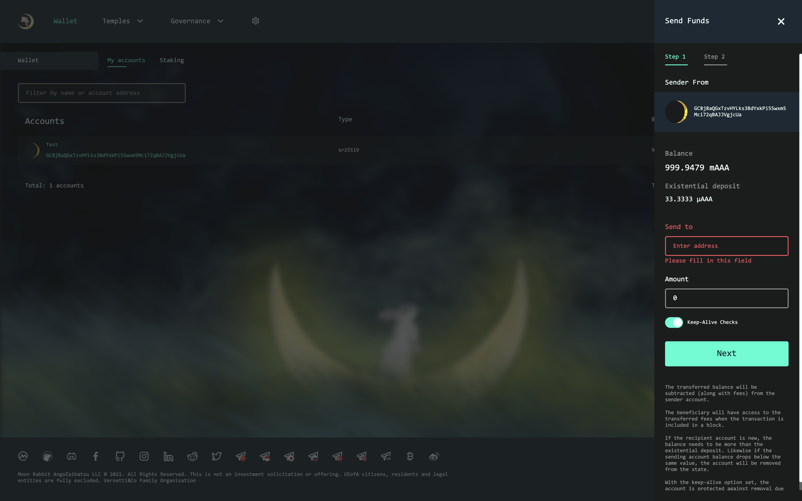

### How to send tokens

In order to transfer tokens to another account on the main page, click on the "Accounts" button.

Select the transfer point.

A window will appear in which you will need to select the account from which the transfer will be made, specify the ID of the recipient of the tokens, and the number of tokens.

Pay attention to fees indicated at the end.
If all the data is correct, click on the "Make Transfer" button.

On the next screen, you must specify the password of the account from which the transfer takes place and click "Sign and Submit" button.

After your transaction is successful, it will appear on the Rabbit Hole page in the Temples tab.

In the latest scriptures block there will be a notification of a successful transaction with a block number in which you can see the details of the transaction.

