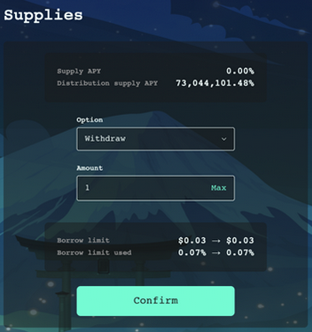
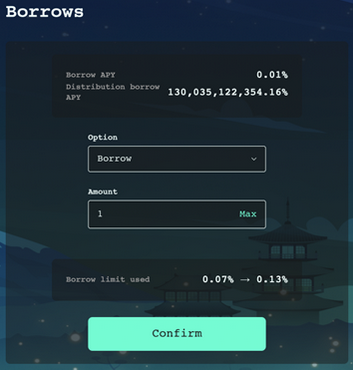

#  MoonRabbit DeFi Instruction

1. Supply and withdraw assets 

- Connect Metamask wallet to the platform 

- Choose asset you would like to add, for example, AAA 

- Press on asset and choose “Supply” option in “Supplies”, enter the amount you would like to supply to the pool, press “Confirm” button 

> Congratulations!!! You supplied an asset to MoonRabbit DeFi! 

> If you want to withdraw asset from the pool choose “Withdraw” option in “Supplies”, enter the amount you would like to withdraw from the pool, press “Confirm” button 

2. Borrow and repay assets

- Connect Metamask wallet to the platform 

- Choose an asset you would like to borrow, for example, AAA.

>> **Note: It is important to understand that before borrowing assets from the MoonRabbit DeFi you need to supply collateral assets which can serve as a collateral, for example, AAA. If an asset can serve as a collateral it is marked as “YES” on “Can be collateral” option.**

- Press on asset and choose the “Borrow” option in “Borrows”, enter the amount you would like to borrow to the pool, press the “Confirm” button. You can not borrow more than your supplied collateral allows you to borrow. 

>> **Note: If you borrow maximum allowed amount you are at risk of liquidation if the price of your collateral assets will fall or price of the asset you are willing to borrow increase.**  

> Congratulations!!! You borrowed an asset to MoonRabbit DeFi! 

> If you want to repay borrowed earlier asset from the pool choose the “Repay” option in “Borrows”, enter the amount you would like to repay to the pool, press “Confirm” button. 

>> **Note: to fully repay the loan you need more of the asset than you borrowed because of interest accrued for the time from the moment of initial borrowing to repay the loan.**
