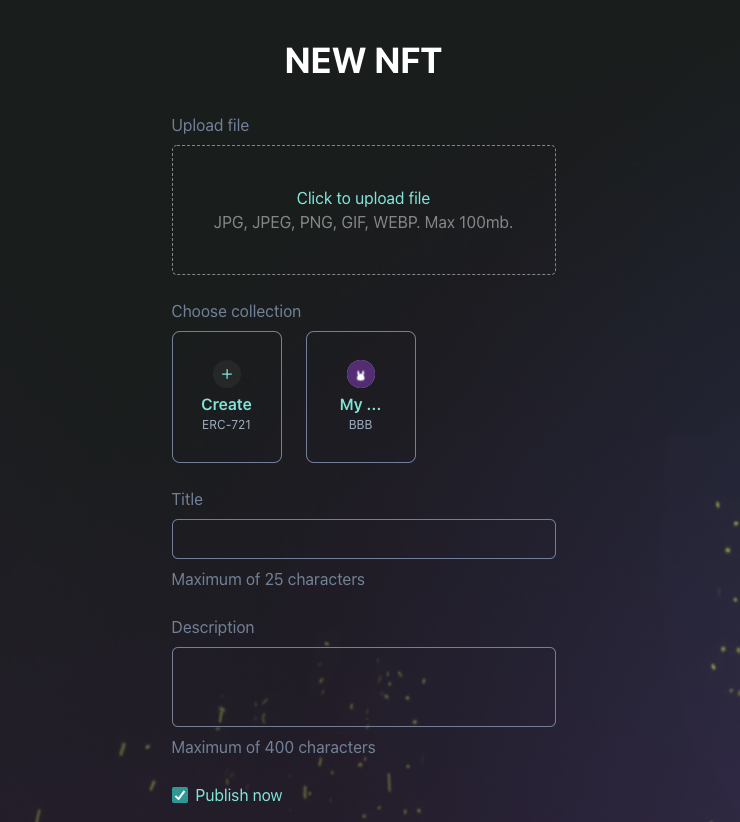

# How can I upload my NFT to the marketplace?

## Before you begin.

Make sure:

- You have enough AAA on your Moon Rabbit EVM account to cover gas fees for minting.
- Make sure your Metamask wallet is connected. Click “Connect to wallet”.
- Make sure your file is supported. Maximum file size is 100Mb. Supported file types:
	* JPG
	* JPEG
	* PNG
	* GIF
	* MP4
	* WEBP

You can suggest other file formats by contacting the Moon Rabbit team (https://www.moonrabbit.com).

## Step 1. Upload a file and create a collection

Each NFT must belong to a collection. 

Click “Create NFT” button and upload your file.

Then click “Create” under the “Choose collection” section. 

Add a collection cover and avatar.

Enter Collection name, description and collection symbol. 

Collection is saved to the blockchain. Save the collection by confirming the transaction in your Metamask.

