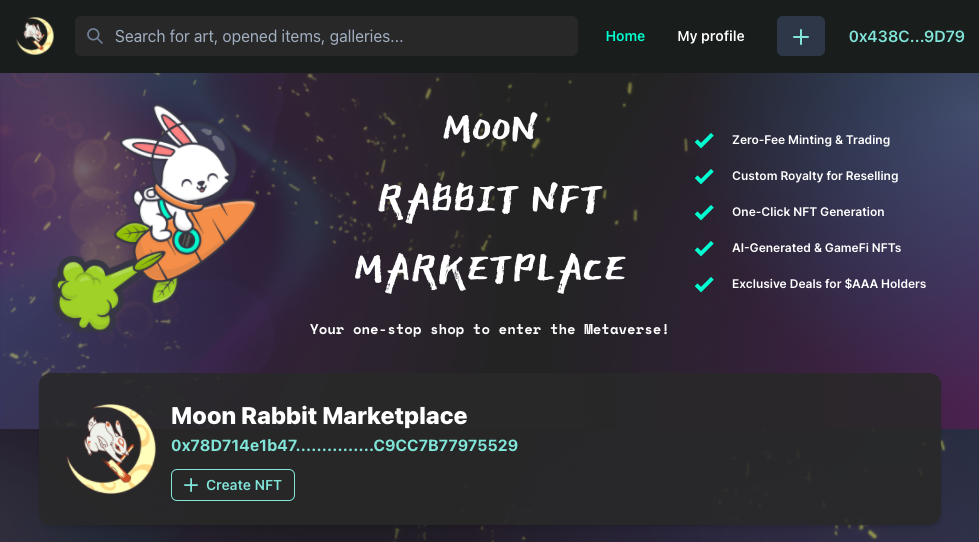

# What is Moon Rabbit NFT Marketplace?

Moon Rabbit NFT Marketplace is a decentralized marketplace that allows the buying and selling of non-fungible tokens.

It is a peer-to-peer marketplace for crypto collectibles and non-fungible tokens. It includes collectibles, metaverse items and other virtual goods. On Moon Rabbit NFT Marketplace anyone can buy or sell these items through a smart contract.

**NFT creators can earn royalties on each resale in future.**

