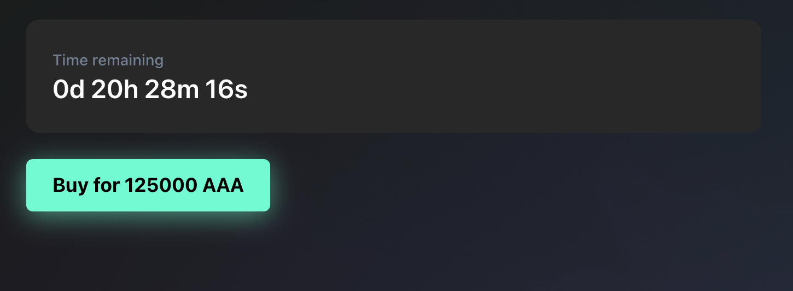

# Sale types

There are 2 ways to sell your NFT:

1) Auction;

2) Fixed price sale;

## Auction

This type of sale is time-limited and is based on bids. Potential buyers place competitive bids on the NFT. Each bidder must outbid the previous one.

Seller sets a starting price and time range for the auction. Auction can be launched immediately or at a certain date and time.

Once an auction is launched, the seller cannot stop it until the end of the auction time.

First bidder must set his bid equal to or higher than the starting bid, which is set by the seller.

Whoever places the highest bid at the auction end, wins and can claim the NFT.

Last bid is transferred to the seller when the buyer claims the NFT.

Royalties are transferred to the NFT original creator after each successful sale.

If you are not the original creator of the NFT and royalties are present, you will receive the amount minus the royalty amount.

## Fixed price sale

This type of sale is also time limited, but the sale is processed immediately once the buyer completes the transaction.

Fixed price sale is also limited in time, but it ends as soon as the transaction is complete.

Seller sets the price and time range for the sale.

