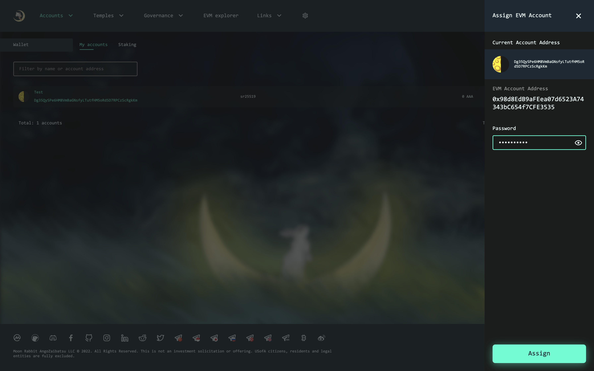
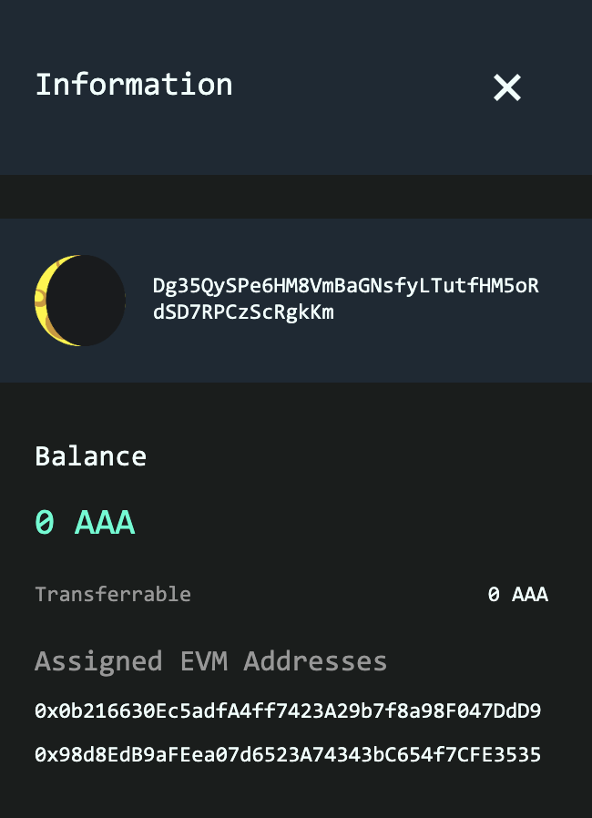

# Assigning Moon Rabbit EVM address to Moon Rabbit address

Some DeFi projects that is running on Moon Rabbit EVM may do drops based on your Moon Rabbit balance or staked amount. To allow such DeFi projects to easy identify your EVM addresses your may assign it to Moon Rabbit address.

## Assigning address

1. Open wallet page

2. Click button "Assign EVM Account"

3. You will see a form to confirm assigning address. Enter your wallet password and click "Assign" button

4. You will be requested to sign message with Metamask to confirm ownership

5. After successful adding you will be able to see assigned EVM addresses in the account info window

