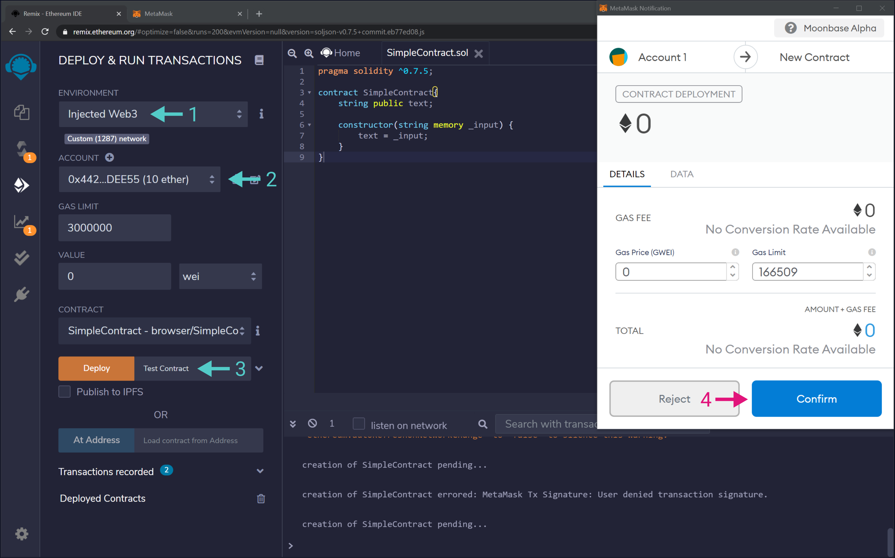

# Deploying EVM contracts on Moon Rabbit EVM


## Using OpenZeppelin Contracts To Deploy To Moon Rabbit EVM


### Introduction

OpenZeppelin contracts and libraries are a standard in the industry. They minimize risk, as their open-source code templates are battle-tested for Ethereum and other blockchains. Their code includes the most used implementations of ERC standards and add-ons and often appear in guides and tutorials around the community.

Because Moon Rabbit EVM is fully Ethereum compatible, all of OpenZeppelin's contracts and libraries can be implemented without any changes.

This guide is divided into two sections. The first part describes the OpenZeppelin Contracts Wizard, a great online tool to help you create smart contracts using OpenZeppelin code. The second section provides a step-by-step guide on how you can deploy these contracts using Remix on Moon Rabbit EVM.


### OpenZeppelin Contract Wizard

Contracts Wizard is a web application to interactively build a contract out of components from OpenZeppelin Contracts. Select the kind of contract that you want, set your parameters and desired features, and the Wizard will generate all of the code necessary. The resulting code is ready to be compiled and deployed, or it can serve as a starting point and be customized further with application specific logic.

Currently, the Contracts Wizard support the following ERC standards:


* ERC20 — a fungible token standard that follows EIP-20. Fungible means that all tokens are equivalent and interchangeable that is, of equal value. One typical example of fungible tokens is fiat currencies, where each equal-denomination bill has the same value.
* ERC721 — a non-fungible token contract that follows EIP-721. Non-fungible means that each token is different, and therefore, unique. An ERC721 token can represent ownership of that unique item, whether it is a collectible item in a game, real estate, and so on.
* ERC1155 — also known as the multi-token contract, because it can represent both fungible and non-fungible tokens in a single smart contract. It follows EIP-1155

The wizard comprises the following sections:


1. **Token standard selection** — shows all the different standards supported by the wizard.
2. **Settings** — provides the baseline settings for each token standard, such as token name, symbol, pre-mint (token supply when the contract is deployed), and URI (for non-fungible tokens).
3. **Features** — list of all features available for each token standard. You can find more information about the different features in the following links:
    * ERC20
    * ERC721
    * ERC1155
4. **Access Control** — list of all the available access control mechanisms for each token standard.
5. **Interactive code display** — shows the smart contract code with the configuration as set by the user.


Once you have set up your contract with all the settings and features, simply copy and paste the code into your contract file.


## Deploying OpenZeppelin Contracts on Moon Rabbit EVM

This section goes through the steps for deploying OpenZeppelin contracts on Moon Rabbit EVM. It covers the following contracts:


* ERC20 (fungible tokens)
* ERC721 (non-fungible tokens)
* ERC1155 (multi-token standard)

All the code of the contracts was obtained using OpenZeppelin Contract Wizard.


### Checking Prerequisites

The steps described in this section assume you have MetaMask installed and connected to the Moon Rabbit EVM Testnet. Contract deployment is done using the Remix IDE via the "Injected Web3" environment. You can find corresponding tutorials in the following links:


* [Connecting Moon Rabbit EVM to MetaMask](MetamaskConnecting.md)


### Deploying an ERC20 Token

For this example, an ERC20 token will be deployed to Moon Rabbit EVM Mainnet. The final code used combines different contracts from OpenZeppelin:


* **ERC20.sol** — ERC20 token implementation with the optional features from the base interface. It includes the supply mechanism with a `mint` function but needs to be explicitly called from within the main contract
* **Ownable.sol** — extension to restrict access to certain functions

The mintable ERC20 OpenZeppelin token contract provides a `mint` function that the only the owner of the contract can call. By default, the owner is the contract's deployer address. There is also a premint of `1000` tokens sent to the contract's deployer configured in the `constructor` function.

The first step is to go to Remix and take the following steps:


1. Click on the "Create New File" icon and set a file name. For this example, it was set to `ERC20.sol`
2. Make sure the file was created successfully. Click on the file to open it up in the text editor
3. Write your smart contract using the file editor. For this example, the following code was used:


```
pragma solidity ^0.8.0;

import "@openzeppelin/contracts/token/ERC20/ERC20.sol";
import "@openzeppelin/contracts/access/Ownable.sol";

contract MyToken is ERC20, Ownable {
    constructor() ERC20("MyToken", "MTK") {
        _mint(msg.sender, 1000 * 10 ** decimals());
    }

    function mint(address to, uint256 amount) public onlyOwner {
        _mint(to, amount);
    }
}
```


This ERC20 token smart contract was extracted from the Contract Wizard, setting a premint of `1000` tokens and activating the `Mintable` feature.


Once your smart contract is written, you can compile it by taking the following steps:


1. Head to the "Solidity Compiler`.
2. Click on the compile button.
3. Alternatively, you can check the "Auto compile" feature.


With the contract compiled, you are ready to deploy it taking the following steps:


1. Head to the "Deploy & Run Transactions" tab.
2. Change the environment to "Injected Web3". This will use MetaMask's injected provider. Consequently, the contract will be deployed to whatever network MetaMask is connected to. MetaMask might show a pop-up outlining that Remix is trying to connect to your wallet.
3. Select the proper contract to deploy. In this example, it is the `MyToken` contract inside the `ERC20.sol` file.
4. If everything is ready, click on the "Deploy" button. Review the transaction information in MetaMask and confirm it.
5. After a few seconds, the transaction should get confirmed, and you should see your contract under "Deployed Contracts"


And that is it! You've deployed an ERC20 token contract using OpenZeppelin's contracts and libraries. Next, you can interact with your token contract via Remix, or add it to MetaMask.


### Deploying an ERC721 Token

For this example, an ERC721 token will be deployed to Moon Rabbit EVM Mainnet. The final code used combines different contracts from OpenZeppelin:


* **ERC721** — ERC721 token implementation with the optional features from the base interface. It includes the supply mechanism with a `_mint` function but needs to be explicitly called from within the main contract.
* **Burnable** — extension to allow tokens to be destroyed by their owners (or approved addresses).
* **Enumerable** — extension to allow on-chain enumeration of tokens.
* **Ownable.sol** — extension to restrict access to certain functions.

The mintable ERC721 OpenZeppelin token contract provides a `mint` function that can only be called by the owner of the contract. By default, the owner is the contract's deployer address.

As with the ERC20 contract, the first step is to go to Remix and create a new file. For this example, the file name will be `ERC721.sol`.

Next, you'll need to write the smart contract and compile it. For this example, the following code is used:


```
pragma solidity ^0.8.0;

import "@openzeppelin/contracts/token/ERC721/ERC721.sol";
import "@openzeppelin/contracts/token/ERC721/extensions/ERC721Enumerable.sol";
import "@openzeppelin/contracts/token/ERC721/extensions/ERC721Burnable.sol";
import "@openzeppelin/contracts/access/Ownable.sol";

contract MyToken is ERC721, ERC721Enumerable, ERC721Burnable, Ownable {
    constructor() ERC721("MyToken", "MTK") {}

    function safeMint(address to, uint256 tokenId) public onlyOwner {
        _safeMint(to, tokenId);
    }

    function _baseURI() internal pure override returns (string memory) {
        return "Test";
    }

    function _beforeTokenTransfer(address from, address to, uint256 tokenId)
        internal
        override(ERC721, ERC721Enumerable)
    {
        super._beforeTokenTransfer(from, to, tokenId);
    }

    function supportsInterface(bytes4 interfaceId)
        public
        view
        override(ERC721, ERC721Enumerable)
        returns (bool)
    {
        return super.supportsInterface(interfaceId);
    }
}
```


This ERC721 token smart contract was extracted from the Contract Wizard, setting the `Base URI` as `Test` and activating the `Mintable`, `Burnable`, and `Enumerable` features.

With the contract compiled, head to the "Deploy & Run Transactions" tab. In here, you need to:


1. Change the environment to "Injected Web3". This will use MetaMask's injected provider. Consequently, the contract will be deployed to whatever network MetaMask is connected to. MetaMask might show a pop-up outlining that Remix is trying to connect to your wallet
2. Select the proper contract to deploy. In this example, it is the `MyToken` contract inside the `ERC721.sol` file
3. If everything is ready, click on the "Deploy" button. Review the transaction information in MetaMask and confirm it
4. After a few seconds, the transaction should get confirmed, and you should see your contract under "Deployed Contracts"


And that is it! You've deployed an ERC721 token contract using OpenZeppelin's contracts and libraries. Next, you can interact with your token contract via Remix, or add it to MetaMask.


### Deploying an ERC1155 Token

For this example, an ERC1155 token will be deployed to Moon Rabbit EVM Mainnet. The final code used combines different contracts from OpenZeppelin:


* **ERC1155** — ERC1155 token implementation with the optional features from the base interface. Includes the supply mechanism with a `_mint` function but needs to be explicitly called from within the main contract
* **Pausable** — extension to allows pausing tokens transfer, mintings, and burnings
* **Ownable.sol** — extension to restrict access to certain functions

OpenZeppelin's ERC1155 token contract provides a `_mint` function that can only be called in the `constructor` function. Therefore, this example creates 1000 tokens with an ID of `0`, and 1 unique token with an ID of `1`.

The first step is to go to Remix and create a new file. For this example, the file name will be `ERC1155.sol`.

As shown for the ERC20 token, you'll need to write the smart contract and compile it. For this example, the following code is used:


```
pragma solidity ^0.8.0;

import "@openzeppelin/contracts/token/ERC1155/ERC1155.sol";
import "@openzeppelin/contracts/access/Ownable.sol";
import "@openzeppelin/contracts/security/Pausable.sol";

contract MyToken is ERC1155, Ownable, Pausable {
    constructor() ERC1155("Test") {
        _mint(msg.sender, 0, 1000 * 10 ** 18, "");
        _mint(msg.sender, 1, 1, "");
    }

    function setURI(string memory newuri) public onlyOwner {
        _setURI(newuri);
    }

    function pause() public onlyOwner {
        _pause();
    }

    function unpause() public onlyOwner {
        _unpause();
    }

    function _beforeTokenTransfer(address operator, address from, address to, uint256[] memory ids, uint256[] memory amounts, bytes memory data)
        internal
        whenNotPaused
        override
    {
        super._beforeTokenTransfer(operator, from, to, ids, amounts, data);
    }
}
```


This ERC1155 token smart contract was extracted from the Contract Wizard, setting no `Base URI` and activating `Pausable` feature. The constructor function was modified to include the minting of both a fungible and a non-fungible token.

With the contract compiled, head to the "Deploy & Run Transactions" tab. Here, you will be required to:


1. Change the environment to "Injected Web3". This will use MetaMask's injected provider. Consequently, the contract will be deployed to whatever network MetaMask is connected to. MetaMask might show a pop-up outlining that Remix is trying to connect to your wallet
2. Select the proper contract to deploy. In this example, it is the `MyToken` contract inside the `ERC1155.sol` file
3. If everything is ready, click on the "Deploy" button. Review the transaction information in MetaMask and confirm it
4. After a few seconds, the transaction should get confirmed, and you should see your contract under "Deployed Contracts"


And that is it! You've deployed an ERC1155 token contract using OpenZeppelin's contracts and libraries. Next, you can interact with your token contract via Remix.


## Using Remix Contracts To Deploy To Moon Rabbit EVM


### Introduction

Another tool developers can use to interact with Moon Rabbit EVM is the Remix IDE, one of the most commonly used development environments for smart contracts on Ethereum. It provides a web-based solution to quickly compile and deploy Solidity and Vyper based code to either a local VM or, more interestingly, an external Web3 provider, such as MetaMask. By combining both tools, one can get started very swiftly with Moon Rabbit EVM.


### Deploying a Contract to Moon Rabbit EVM

To demonstrate how you can leverage Remix to deploy smart contracts to Moon RabbitEVM, we will use the following basic contract:


```
pragma solidity ^0.7.5;
contract SimpleContract{
    string public text;

    constructor(string memory _input) {
        text = _input;
    }
}
```


Once you've compiled the contract and are ready to deploy you can navigate to the "Deploy & Run Transactions" tab in Remix and follow these steps:


1. Set the Remix environment to "Injected Web3".
2. Set your account and ensure you have funds. For Moon Rabbit EVM Testnet, you can use our TestNet faucet.
3. Pass in `Test Contract` as input to the contructor function and hit "Deploy".
4. MetaMask will pop-up and show the information regarding the transaction, which you'll need to sign by clicking "Confirm".





Once the transaction is included, the contract appears in the "Deployed Contracts" section on Remix. There we can interact with the functions available from our contract.


