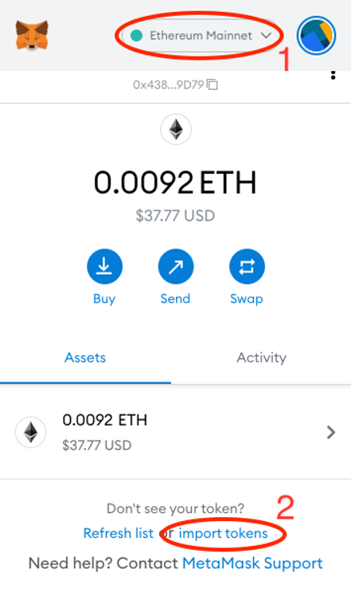
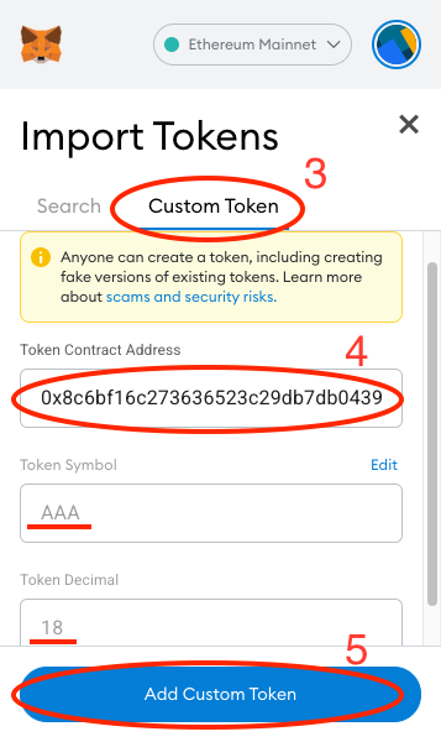
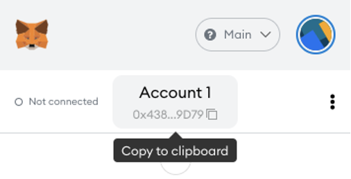
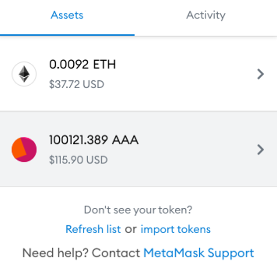

# How to view my AAA tokens on Metamask?

### Step 1. Download and install Metamask

Visit [https://metamask.io/](https://metamask.io/) and download the app. Follow the instructions to set up your MetaMask account.

### Step 2. Add ERC-20 AAA token to your MetaMask

Open MetaMask and make sure your selected network is **Ethereum Mainnet**.
Scroll down and click “Import tokens”
Select “Custom Token” and enter the following contract address:

`0x8c6bf16c273636523c29db7db04396143770f6a0`

> You can verify this contract address [here](https://etherscan.io/token/0x8c6bf16c273636523c29db7db04396143770f6a0).

Confirm by clicking “Add custom token” and then “Import tokens”.
You should now see AAA on your ERC-20 token list.

### Step 3. Withdraw AAA coins from your exchange to your Metamask account on the Ethereum mainnet (ERC-20). 

On your exchange platform go to the “withdraw” section and send your tokens to your MetaMask wallet number. Copy your MetaMask wallet number here:

### Step 4. Check your balance 

Once you successfully withdraw AAA from your exchange, you will see the amount on your Metamask:

