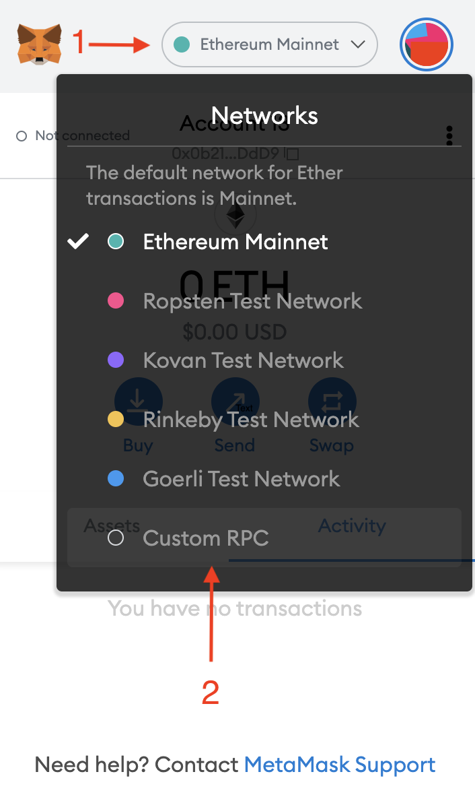

# Connecting to Metamask

Open Metamask and click on "Networks" on top of the screen and select Custom RPC.

Enter the network data and click "Save".

Here is the data for mainnet and testnet:

Mainnet

Network Name: Moon Rabbit EVM

New RPC URL: https://evm.moonrabbit.com

Chain ID: 1280

Currency Symbol: AAA

Testnet

Network Name: Moon Rabbit EVM Testnet

New RPC URL: https://testnetevm.moonrabbit.com

Chain ID: 1280

Currency Symbol: AAA
