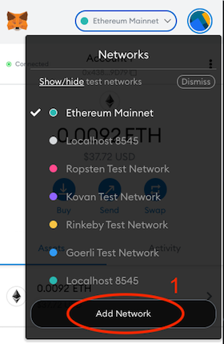
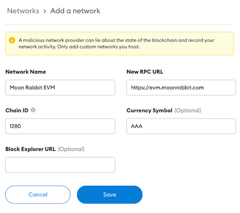
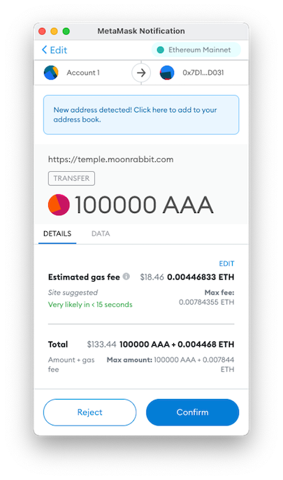

# How to transfer my AAA to Moon Rabbit EVM?

In order to use AAA tokens on the Moon Rabbit network, they must be transferred to the Moon Rabbit EVM first. You can do that using the [Moon Rabbit Bridge](https://temple.moonrabbit.com/bridge/tokens). 

### Step 1. Add the Moon Rabbit EVM network to your MetaMask.

1. Open MetaMask and click “Add Network” button in the “Networks” drop-down menu. 

	

2. Enter the following settings:

Network Name: `Moon Rabbit EVM`

New RPC URL: `https://evm.moonrabbit.com`

Chain ID: `1280`

Currency Symbol: `AAA`

.
    

3. Click “Save”.

You should now see Moon Rabbit EVM on the list of networks in Metamask.

### Step 2. Visit Moon Rabbit EVM Bridge and switch to the correct network.

Visit the EVM bridge: [https://temple.moonrabbit.com/bridge/tokens](https://temple.moonrabbit.com/bridge/tokens)

Switch your Metamask to Ethereum Mainnet. Enter the desired amount and click “Next”

Follow the instructions and confirm the transaction.
_Remember! You need enough ETH to cover the Gas Fees for this transaction._

### Step 3. Check your AAA balance on the Moon Rabbit EVM network.

Once the transaction goes through, switch to the Moon Rabbit EVM network and you will see your balance.

Now you can use AAA on the Moon Rabbit Network.

