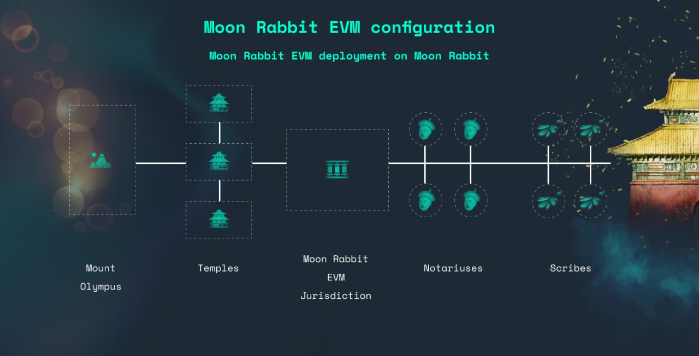

# Welcome to Moon Rabbit EVM

## Introduction

This documentation describes the Moon Rabbit EVM, a Jurisdiction on the Moon Rabbit network that is fully Ethereum Compatible.

In this documentation useful information for users, developers, researchers could be fined, from the most technical to simply general.

## What is Moon Rabbit EVM?

Moon Rabbit EVM is a jurisdiction of the Moon Rabbit. That means it will get shared security from the Moon Rabbit Chain and will be able to integrate with other chains that are connected to Moon Rabbit.

Moreover, Moon Rabbit EVM uniqueness is full EVM implementation and a Web3-compatible API. This allows developers to deploy existing Solidity smart contracts to Moon Rabbit EVM with minimal changes.

## Architecture

## General network data

Parameter | Value
--- | ---
Minimum gas price | 1 Gwei*
Target block time | 12 seconds
Transaction gas limit | 12.995M
Block gas limit | 15M

## Networks

**Testnet**: RPC - https://testnetevm.moonrabbit.com, Chain ID - 1280

**Mainnet**: RPC - https://evm.moonrabbit.com, Chain ID - 1280

## Wallets

* [Metamask](https://metamask.io/download)

## Deploy a Contract

Because of Moon Rabbit's Ethereum compatibility features, known tools can be used to deploy a smart contract:

* Ethereum Libraries
* Remix
* OpenZeppelin and Remix
* HardHat
* Truffle
* Waffle and Mars

## Tools and Integrations

* Web3.js
* Ethers.js
* Web3.py
* The Graph
* Covalent API
* Debug API & Trace Module
