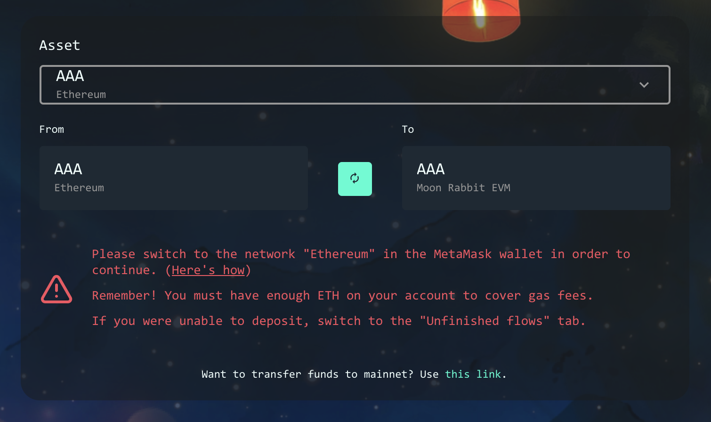

# Help! I did not receive my AAA.

Sometimes users may run into some issues when transferring AAA from Ethereum Mainnet to the Moon Rabbit EVM. This guide will help you troubleshoot those issues.

In case your EVM transaction did not go through or you did not receive your AAA on the EVM network, don't worry. Your funds are not gone.

Here's a checklist of steps to perform to troubleshoot the issue:

## 1. Check your ETH balance.
EVM Bridge requires ETH to cover gas fees of the Ethereum network. Make sure you have enough ETH on your wallet to cover the fees.

## 2. Make sure you selected the correct network.
EVM Bridge has clear instructions on how to use it. Please pay extra attention to the instructions when using the EVM Bridge.

In order to transfer AAA to Moon Rabbit EVM, you need to have the EVM network added to your Metamask:

Network Name: `Moon Rabbit EVM`

New RPC URL: `https://evm.moonrabbit.com`

Chain ID: `1280`

Currency Symbol: `AAA`

You can read the full instructions in the "How to transfer AAA to EVM" section of this guide.

## 3. Check your unfinished flows tab.

One of the most common reasons AAA does not appear on user's account is an unfinished flow.
If you did not switch to Moon Rabbit EVM network to confirm the transaction, the unfinished transaction will stay on the Unfinished flows tab. Click the tab or visit the following link to see your transaction:
[Unfinished flows](https://temple.moonrabbit.com/bridge/unfinished-flows)

If the list is empty, try switching your MetaMask between Ethereum mainnet and Moon Rabbit EVM.

Once you see your unfinished flow, click "Repeat" and follow the instructions.

> If you still have issues after performing the above steps, feel free to ask for assistance in our [global Telegram group](https://t.me/moonrabbitcom).