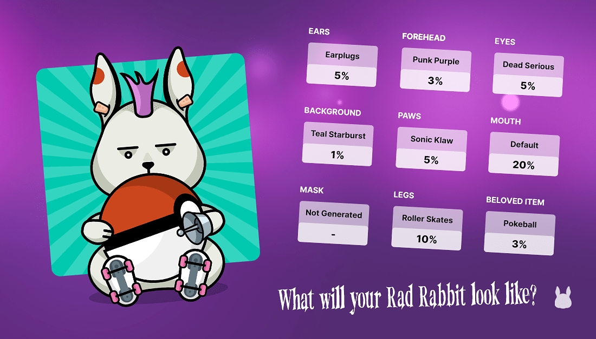

# How are Rad Rabbits created? 

Rad Rabbits are randomly generated using probability values for each trait/item.
There are 9 traits for each NFT:

* Background
* Ears
* Mouth and nose
* Feet
* Item Held
* Paws
* Eyes
* Forehead
* Mask (5% probability. If a mask is present, eyes and mouth are not)

You can view the items and traits here: [https://www.radrabbits.org/gallery](https://www.radrabbits.org/gallery)
Each trait has its probability value to make sure they are all unique.
There are some Legendary Rad rabbits. They are unique and extremely rare. 
In total the number of possible combinations is close to infinity (but not infinite).
Only 8888 Rabbits exist which means no two rabbits are the same.

> **Unsold Rad Rabbits will be frozen forever after the end of sale!**

