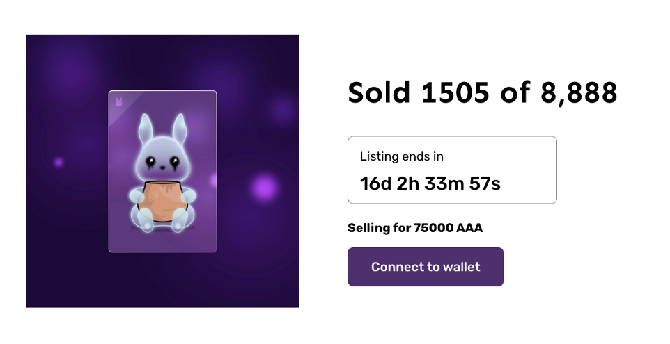
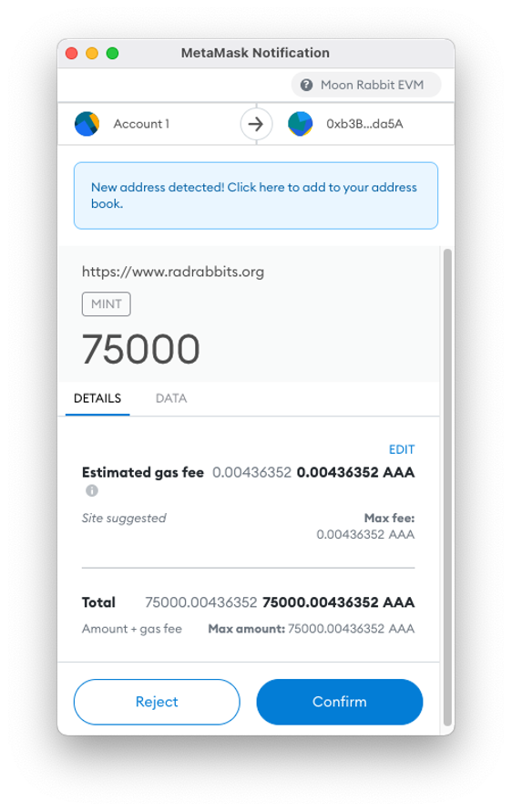
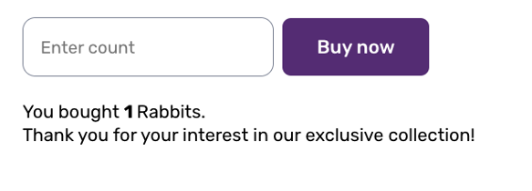
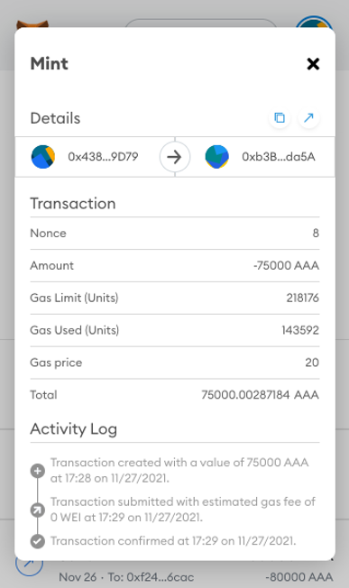

# How to buy Rad Rabbits?

**Rad Rabbit is your key to the Moon Rabbit Metaverse.**

In order to buy Rad Rabbit NFTs you need to have $AAA to your Moon Rabbit EVM account. 
Make sure you have connected your Metamask Moon Rabbit EVM account with the following settings:

Network Name: `Moon Rabbit EVM`

New RPC URL: `https://evm.moonrabbit.com`

Chain ID: `1280`

Currency Symbol: `AAA`

You can find a full tutorial here: https://lib.moonrabbit.com/ ("Connecting to Metamask" section)

1. Visit [https://www.radrabbits.org/](https://www.radrabbits.org/) and connect your wallet:
	
2. Make sure you have selected Moon Rabbit EVM in Metamask.
3. Enter the number of NFTs you want to buy and click “Buy now”.
4. Confirm the transaction and wait for the Rad Rabbit to mint.
	
5. You will see a confirmation message below:
	
6. Congratulations! Your Rad Rabbit is now on your account. You will see it once the late reveal ends. You can see your minted NFT in your transaction history. Also you can visit the [Moon Rabbit NFT Marketplace](https://www.nft.moonrabbit.com/), connect your MetaMask and view your Rad Rabbit in the “My Profile” section.

